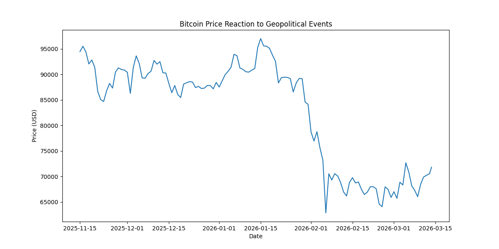
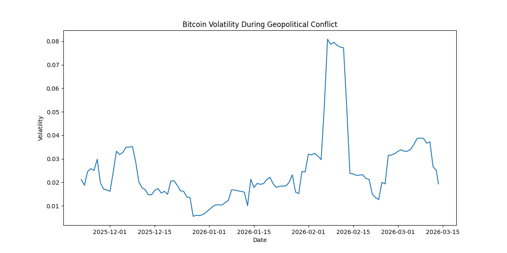
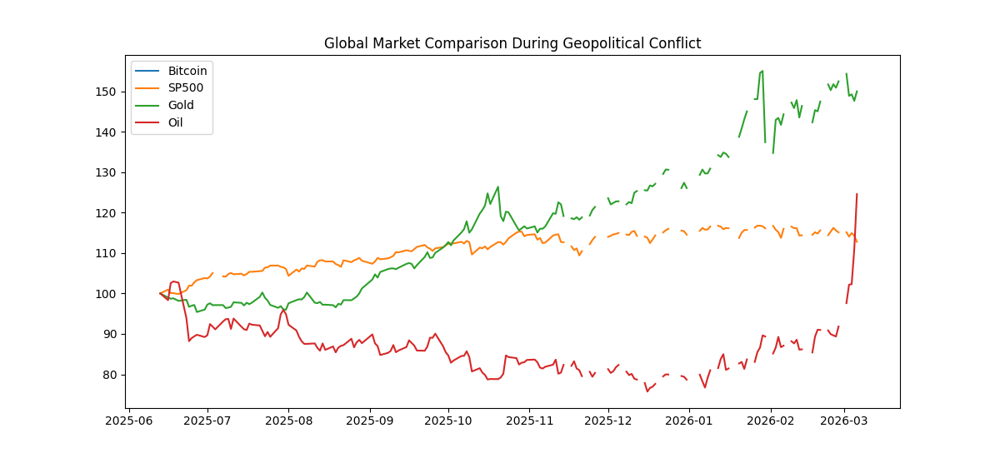
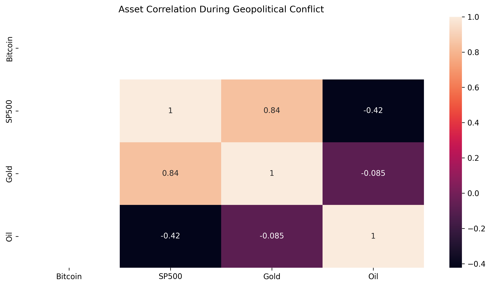

# Crypto, Geopolitics & Financial Market Analysis

## Project Overview
This project analyzes how major geopolitical conflicts influence global financial markets, with a particular focus on Bitcoin and its relationship with traditional safe-haven assets.

Assets analyzed:
- Bitcoin
- S&P 500
- Gold
- Oil

The analysis explores price reactions, volatility spikes, and cross-market correlations during periods of geopolitical instability.

---

## Key Questions
- Does Bitcoin behave like a safe-haven asset during geopolitical crises?
- How does Bitcoin volatility compare with traditional markets?
- Are crypto and traditional markets correlated during global shocks?

---

## Dataset
The dataset includes daily price data for:
- Bitcoin
- S&P 500
- Gold
- Oil

Source: Yahoo Finance historical market data.

---

## Visualizations

### Bitcoin Price Reaction to Geopolitical Events

### Bitcoin Volatility During Conflict

### Global Market Comparison

### Asset Correlation Heatmap

---

## Key Findings

- Bitcoin experienced **sharp volatility spikes** during geopolitical announcements.
- Gold maintained **more stable movement**, reinforcing its safe-haven reputation.
- Correlation between crypto and traditional markets **increased during crisis periods**.
- Market reactions stabilized after the initial geopolitical shock.

---

## Tools Used
- Python
- Pandas
- Matplotlib
- Seaborn
- Jupyter Notebook

---

## Repository Structure

---

## Author
Damilola Aderemilekun Adegboye  
FinTech Data Analyst | Geopolitical Market Research